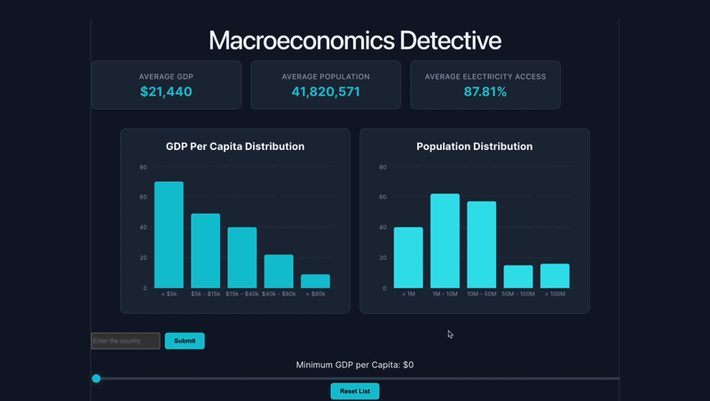

# Web Development Project 5 and 6 - *Macroeconomics Detective*

Submitted by: **Mychel Segrini**

This web app: **Displays macroeconomic data of 190 countries and let you filter.**

Time spent: **4** hours spent in total

## Required Features

The following **required** functionality is completed:

- [X] **The site has a dashboard displaying a list of data fetched using an API call**
  - The dashboard should display at least 10 unique items, one per row
  - The dashboard includes at least two features in each row
- [X] **`useEffect` React hook and `async`/`await` are used**
- [X] **The app dashboard includes at least three summary statistics about the data** 
  - The app dashboard includes at least three summary statistics about the data, such as:
    - *insert details here*
- [X] **A search bar allows the user to search for an item in the fetched data**
  - The search bar **correctly** filters items in the list, only displaying items matching the search query
  - The list of results dynamically updates as the user types into the search bar
- [X] **An additional filter allows the user to restrict displayed items by specified categories**
  - The filter restricts items in the list using a **different attribute** than the search bar 
  - The filter **correctly** filters items in the list, only displaying items matching the filter attribute in the dashboard
  - The dashboard list dynamically updates as the user adjusts the filter
- [X] **Clicking on an item in the list view displays more details about it**
  - Clicking on an item in the dashboard list navigates to a detail view for that item
  - Detail view includes extra information about the item not included in the dashboard view
  - The same sidebar is displayed in detail view as in dashboard view
  - *To ensure an accurate grade, your sidebar **must** be viewable when showing the details view in your recording.*
- [X] **Each detail view of an item has a direct, unique URL link to that item’s detail view page**
  -  *To ensure an accurate grade, the URL/address bar of your web browser **must** be viewable in your recording.*
- [X] **The app includes at least two unique charts developed using the fetched data that tell an interesting story**
  - At least two charts should be incorporated into the dashboard view of the site
  - Each chart should describe a different aspect of the dataset

The following **optional** features are implemented:

- [X] Multiple filters can be applied simultaneously
- [X] Filters use different input types
  - e.g., as a text input, a dropdown or radio selection, and/or a slider
- [X] The user can enter specific bounds for filter values

## Video Walkthrough

Here's a walkthrough of implemented user stories:

<!-- Replace this with whatever GIF tool you used! -->
GIF created with ezgif.com
<!-- Recommended tools:
[Kap](https://getkap.co/) for macOS
[ScreenToGif](https://www.screentogif.com/) for Windows
[peek](https://github.com/phw/peek) for Linux. -->

## License

    Copyright [2026] [Mychel Segrini]

    Licensed under the Apache License, Version 2.0 (the "License");
    you may not use this file except in compliance with the License.
    You may obtain a copy of the License at

        http://www.apache.org/licenses/LICENSE-2.0

    Unless required by applicable law or agreed to in writing, software
    distributed under the License is distributed on an "AS IS" BASIS,
    WITHOUT WARRANTIES OR CONDITIONS OF ANY KIND, either express or implied.
    See the License for the specific language governing permissions and
    limitations under the License.